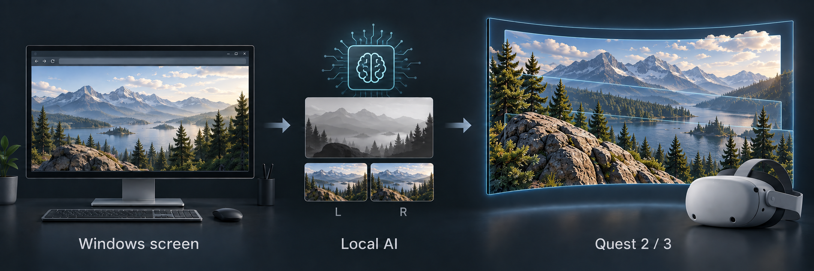

# Quest3D

**Your PC screen in stereo 3D**

Turn your existing browser or player screen into stereo 3D with local AI on your PC. Switch **2D ↔ stereo 3D** on the same large virtual screen in Meta Quest.

[한국어](README.md) · **0.1.2-preview**

Concept illustration · not an app screenshot or conversion result · [Image provenance](docs/assets/README.md)

## Check compatibility

**Windows x64 · NVIDIA Turing (sm75) · Quest 2 / 3 · 16:9 monitor · shared private LAN**

Measured on **RTX 2060 SUPER 8GB / Windows 11**. Memory, encoder support, and performance have not been checked for each other Turing model. Other NVIDIA generations, AMD, and Intel GPUs are currently unsupported. [Support and validation scope](docs/RELEASE_0.1.2_PREVIEW.md)

## Download

| Windows app | Quest app |
|:---|:---|
| **[Desktop Setup EXE](https://github.com/myidwe/Quest3D/releases/download/v0.1.2-preview/Quest3D-Desktop-Setup-0.1.2-preview.exe)** | **[Quest Setup EXE](https://github.com/myidwe/Quest3D/releases/download/v0.1.2-preview/Quest3D-Quest-Setup-0.1.2-preview.exe)** |
| Install the PC app | Install the Quest app over USB |

**Run both files on Windows.** The first PC installation requires internet access and downloads several GB of runtime components, GPU libraries, and models. AI then runs on your PC. There are no software fees, subscriptions, or cloud inference charges.

The Windows EXEs do not yet have trusted code signing; warnings or policy blocks may appear. [Installation conditions](docs/EXE_INSTALLERS.md#권한과-windows-조건)

## Install and connect

1. **Desktop Setup → 설치 (Install) → 연결 허용 (Allow connection) → close the installer**
2. Prepare Quest **Developer mode, USB debugging, and ADB** → install with **Quest Setup**
3. **Quest3D Desktop → PC 시작 (Start PC)**; on Quest: **Scan Network → PC → Pair**
4. **Approve the Quest PIN** in the PC app → **Connect** on Quest

**[First installation and connection →](docs/GETTING_STARTED.en.md)** — prerequisites and each step of the first setup.

Daily use: **Quest3D Desktop → PC 시작 (Start PC) → Connect on Quest**

## Features

- Stream existing browsers and programs; switch 2D/3D and adjust Depth and contour stabilization
- Adjust screen size, distance, position, curvature, color, and sharpness; save views
- Quest 2 / 3 quality profiles, H.264 / HEVC, and PC / Quest sound output options

[User guide](docs/DESKTOP_USER_GUIDE.md) · [Troubleshooting](docs/DESKTOP_USER_GUIDE.md#문제-해결) · [All documentation](docs/README.md) · [Questions and bugs](https://github.com/myidwe/Quest3D/issues)

## Preview notes

Use the Windows mouse and keyboard for PC input. Thin objects and occluded backgrounds may retain stereo contour differences. DRM or capture-blocked content is not guaranteed to work. Sound defaults to PC output; Quest only requires existing Steam Streaming Speakers. See the [release guide](docs/RELEASE_0.1.2_PREVIEW.md) for remaining checks on other PCs, the latest Quest 2 UI, measured audio synchronization, and long sessions. Detailed technical documents are currently in Korean.

How does this relate to OWL3D?

Quest3D is an independent open-source project for live 2D-to-stereo-3D PC screen viewing. It shares part of the use case offered by [OWL3D Link](https://www.owl3d.com/blog/releasesv203), but is not an OWL3D release or fork and is not affiliated with OWL3D. This does not imply matching features or image quality.

Development, manual installation, and validation

- [All Release files](https://github.com/myidwe/Quest3D/releases/tag/v0.1.2-preview): manual installation ZIPs, corresponding Source ZIP, checksums, and validation reports
- [Installation, updates, recovery, and removal](docs/DISTRIBUTION.md) · [Setup permissions](docs/SETUP_PERMISSIONS_2026-09-30.md)
- [Architecture, build, and tests](docs/BUILDING.md) · [Contributing](CONTRIBUTING.md) · [Product scope](docs/PRODUCT_SCOPE.md)
- [Privacy remediation](docs/PRIVACY_REMEDIATION_2026-10-01.md) · [Dependency and corresponding source audit](docs/DEPENDENCY_AUDIT_2026-09-30.md)

GitHub's **Code → Download ZIP** provides development source. For the binaries' native corresponding source, use the **Source ZIP** in that Release. Stream FPS and new AI frame generation are different; 60FPS in every scene is not guaranteed.

Project code: **[GPL-3.0](LICENSE)** · Component and model conditions: [Third-party notices](THIRD_PARTY_NOTICES.md)
