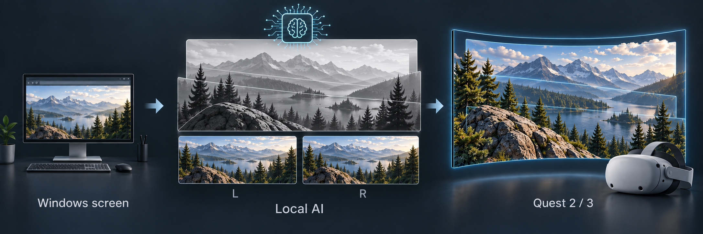
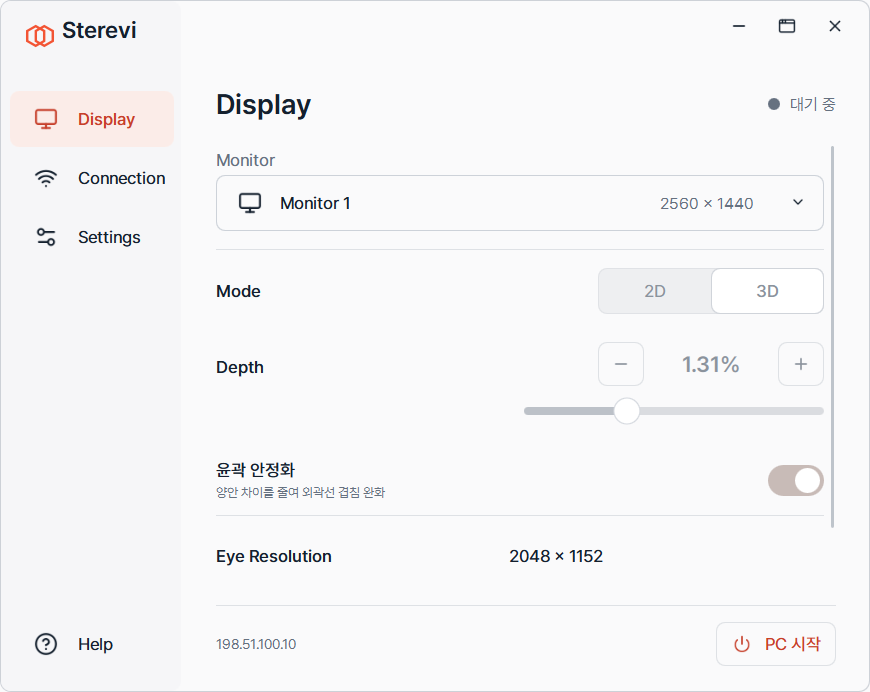
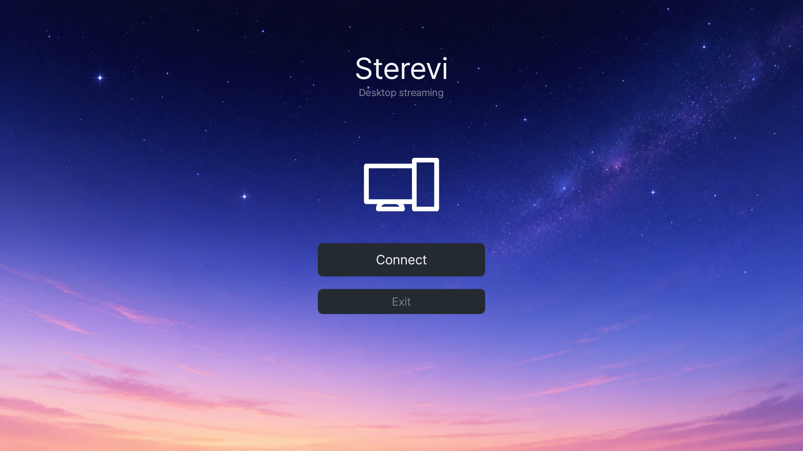
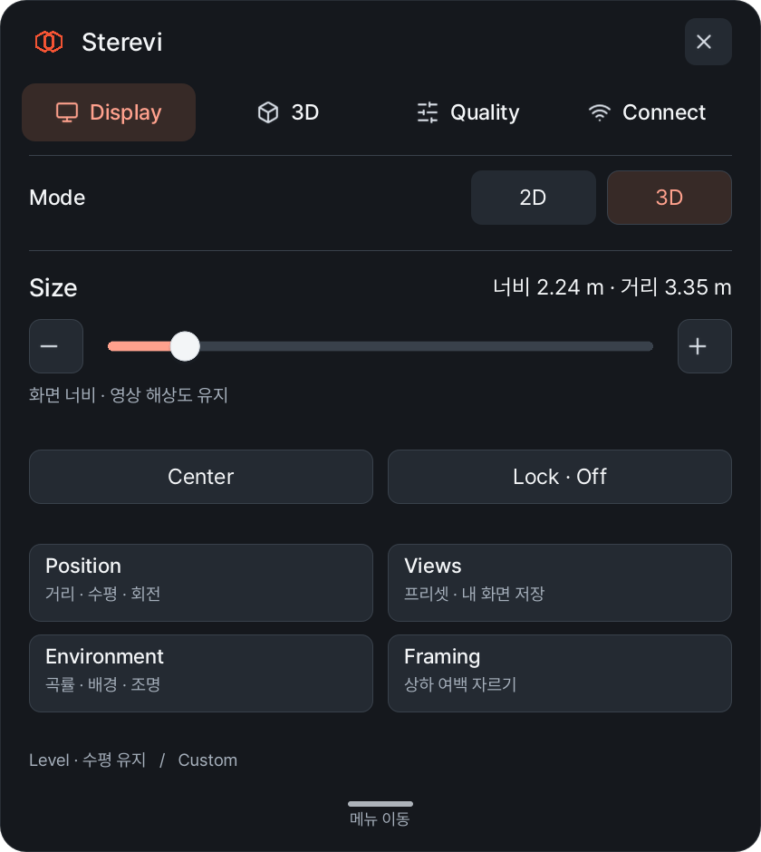

# Sterevi

**익숙한 PC 화면을 Quest에서 입체로**

기존 브라우저·플레이어 화면을 PC의 로컬 AI로 실시간 입체화하고, 같은 가상 화면에서 **2D ↔ 스테레오 3D** 전환

[English](README.en.md) · **0.1.3-preview**

기능 개념도 · 실제 앱 화면·변환 결과 아님 · [이미지 생성 정보](docs/assets/README.md)

## 시작 전 확인

**Windows x64 · NVIDIA Turing(sm75) · Quest 2 / 3 · 16:9 모니터 · 같은 사설 LAN**

실측 장비는 **RTX 2060 SUPER 8GB / Windows 11**입니다. 다른 Turing 모델의 메모리·인코더·성능은 개별 검증하지 않았습니다. 다른 NVIDIA 세대·AMD·Intel GPU는 현재 지원하지 않습니다. [지원·검증 범위](docs/RELEASE_0.1.3_PREVIEW.md)

## 다운로드

| Windows 앱 | Quest 앱 |
|:---|:---|
| **[Desktop Setup EXE](https://github.com/myidwe/Sterevi/releases/download/v0.1.3-preview/Sterevi-Desktop-Setup-0.1.3-preview.exe)** | **[Quest Setup EXE](https://github.com/myidwe/Sterevi/releases/download/v0.1.3-preview/Sterevi-Quest-Setup-0.1.3-preview.exe)** |
| PC 앱 설치 | USB로 Quest 앱 설치 |
| | **[APK 직접 다운로드](https://github.com/myidwe/Sterevi/releases/download/v0.1.3-preview/Sterevi-Quest-0.1.3-preview.apk)** · 기존 설치 도구로 직접 설치 |

**두 파일 모두 Windows에서 실행합니다.** 처음 PC 설치는 인터넷이 필요하며 실행 환경·GPU 라이브러리·모델을 수 GB 다운로드합니다. 이후 AI는 PC에서 실행하며 사용료·구독료·클라우드 추론료는 없습니다.

Windows EXE는 아직 신뢰 코드 서명이 없어 경고·차단이 생길 수 있습니다. [설치 조건](docs/EXE_INSTALLERS.md#권한과-windows-조건)

## 설치와 연결

1. **Desktop Setup → 설치 → 연결 허용 → 설치창 닫기**
2. Quest **개발자 모드·USB 디버깅·ADB 준비** → **Quest Setup**으로 설치
3. **Sterevi Desktop → PC 시작**, Quest에서 **Scan Network → PC → Pair**
4. PC 앱에서 Quest의 **PIN 승인** → Quest **Connect**

**[처음 설치와 연결 안내 →](docs/GETTING_STARTED.md)** — 준비부터 첫 연결까지 순서대로 안내합니다.

다음부터는 **Sterevi Desktop → PC 시작 → Quest Connect**

## 주요 기능

- 기존 브라우저·프로그램 화면 스트리밍, 2D/3D 전환, Depth·윤곽 안정화
- Quest 화면 크기·거리·위치·곡률·색감·선명도 조절과 보기 저장
- Quest 2 / 3 화질 프로필, H.264 / HEVC, PC·Quest 소리 출력 선택

[사용 방법](docs/DESKTOP_USER_GUIDE.md) · [문제 해결](docs/DESKTOP_USER_GUIDE.md#문제-해결) · [문서 전체](docs/README.md) · [문의·오류 제보](https://github.com/myidwe/Sterevi/issues)

## 앱 화면

**Windows · Display**

| Quest · 시작 | Quest · 화면 설정 |
|:---:|:---:|
|  |  |

실제 앱 UI 렌더 · 개인정보 없는 샘플 상태 · 헤드셋 촬영·변환 품질 증거 아님 · [캡처 정보](docs/assets/README.md)

## Preview 안내

PC 조작은 Windows 마우스·키보드를 사용합니다. 얇은 물체·가려진 배경에는 3D 윤곽 차이가 남을 수 있으며 DRM·캡처 차단 콘텐츠는 지원을 보장하지 않습니다. 소리는 PC 출력이 기본이고, Quest only에는 기존 Steam Streaming Speakers가 필요합니다. 다른 PC·최신 Quest 2 UI·정량 음성 동기화·장시간 사용의 남은 검증은 [배포 안내](docs/RELEASE_0.1.3_PREVIEW.md)에서 확인할 수 있습니다.

OWL3D와의 관계

Sterevi는 실시간 PC 화면 2D→3D 감상을 위한 독립 오픈소스 프로젝트입니다. [OWL3D Link](https://www.owl3d.com/blog/releasesv203)와 사용 목적이 일부 겹치지만, OWL3D의 공식판·포크가 아니며 제휴 관계가 없습니다. 기능·화질이 같다는 의미는 아닙니다.

개발·수동 설치·검증 자료

- [전체 Release 파일](https://github.com/myidwe/Sterevi/releases/tag/v0.1.3-preview): 수동 설치 ZIP, 대응 Source ZIP, 체크섬·검증 보고서
- [설치·업데이트·복구·제거](docs/DISTRIBUTION.md) · [설정·권한](docs/SETUP_PERMISSIONS_2026-09-30.md)
- [구조·빌드·테스트](docs/BUILDING.md) · [기여 안내](CONTRIBUTING.md) · [제품 범위](docs/PRODUCT_SCOPE.md)
- [개인정보 수정 내역](docs/PRIVACY_REMEDIATION_2026-10-01.md) · [의존성·대응 소스 감사](docs/DEPENDENCY_AUDIT_2026-09-30.md)

GitHub의 **Code → Download ZIP**은 개발 소스입니다. 바이너리의 native 대응 소스는 해당 Release의 **Source ZIP**을 사용합니다. 송출 FPS와 새 AI 영상 생성 속도는 다르며, 모든 장면의 60FPS를 보장하지 않습니다.

프로젝트 코드: **[GPL-3.0](LICENSE)** · 구성 요소·모델 조건: [Third-party notices](THIRD_PARTY_NOTICES.md)
